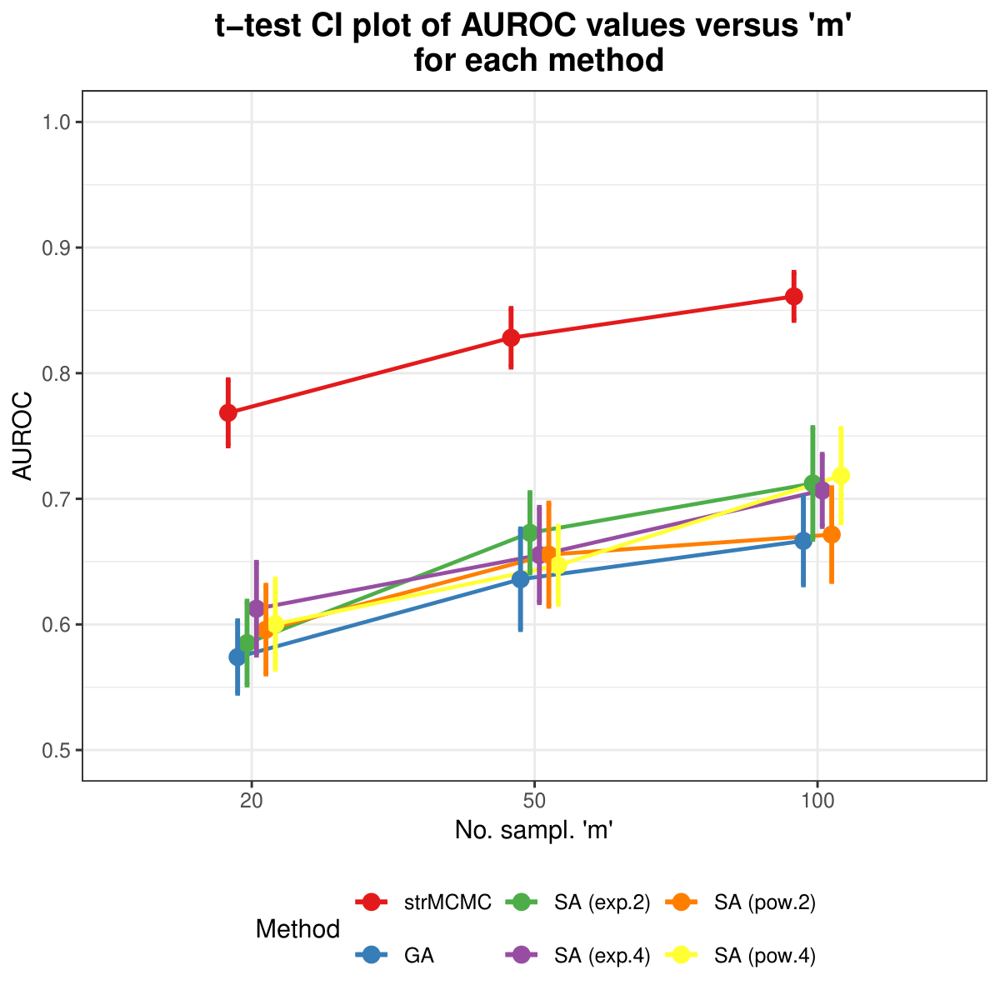

# Simmulated Annealing for Structure Learning

## Overview
This repository contains the final project for an introductory course to Bayesian Networks, taken in 2025/2026 with prof. Marco Grzegorczyk at the University of Groningen. The aim of the project is to present an optimization technique called simmulated annealing in the context of structure learning, and compare it to other established methods.

  
    
  

## Project Structure
This project is organized as follows:

* **`Main.R`**: The primary analysis script. It calls necessary functions, defines relevant hyperparameters and wrapper functions, performs the simulation and produces the final outputs/plots.
* **`Functions.R`**: Contains custom helper functions sourced by `Main.R`.
* **`Final_report.pdf`**: The report which summarizes the work. It introduces simmulated annealing for structure learning (theory and intuition) and it comments on the results of the simulation study. 
* **`AUROC_matrix.rds`, `log_BGe_SA_improvAnal.rds`, `log_BGe_GA_improvAnal`**: Contain the raw numbers used in the final report. The files can be read in the main script, such that the simulation does not need to be rerun.

## Environment & Dependencies

To ensure reproducibility, this analysis was built using the following environment:

* **R Version**: 4.5.0

### Required Packages
Please ensure the following packages are installed before running the code. The versions listed were used during development:

* **stats** (v4.5.0)
* **dplyr** (v1.1.4) 
* **ggplot2** (v4.4.0)
* **limma** (v3.65.5)
* **reshape2** (v1.4.4)
* **ROC** (v1.85.0)

## Author
Andrei-Rafael Secuiu / andrei.secuiu2@gmail.com
